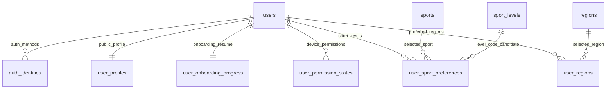
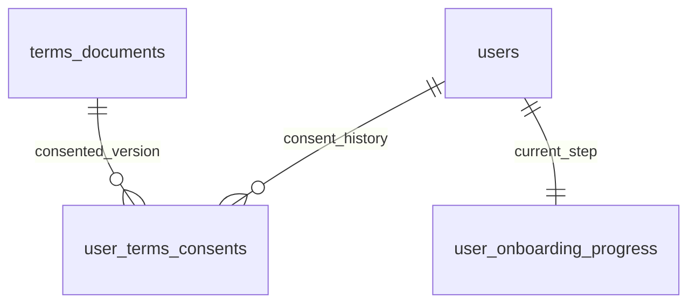
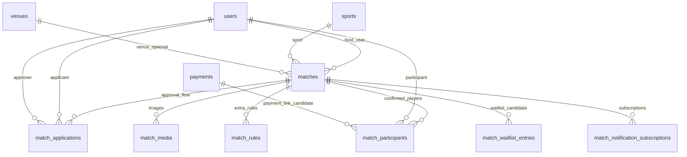
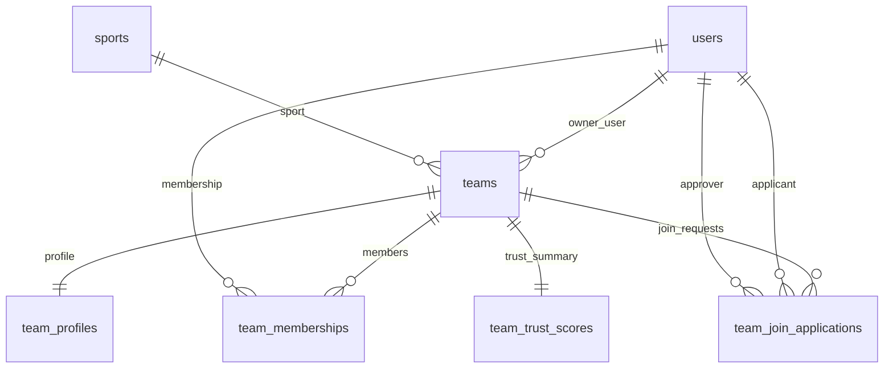
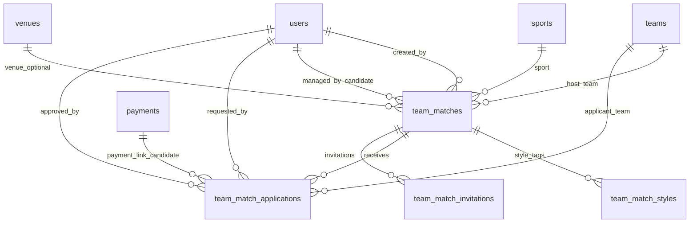
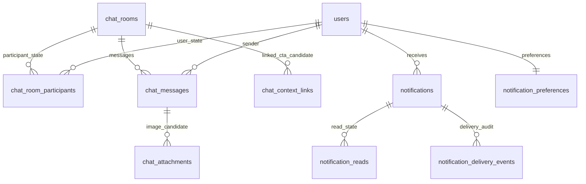
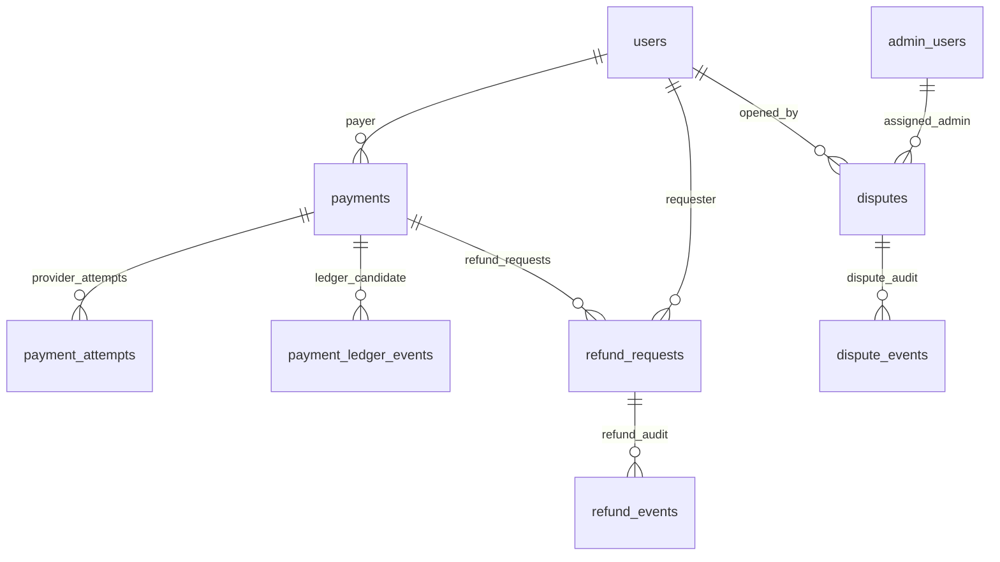
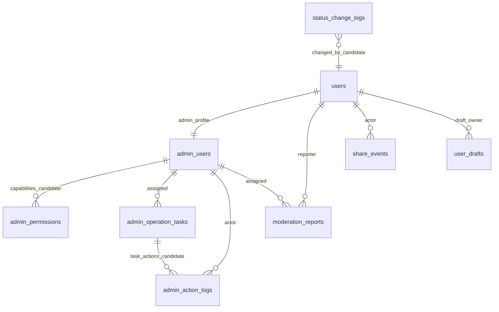

# SM New DB ERD Overview

```text
Status: draft visualization
Source: docs/reference/team-design-first-design-db-plan.md
Design baseline: Team Design > 1차 디자인 완료
Schema status: candidate only, not Prisma migration
API status: not endpoint contract
```

이 문서는 `Team Design > 1차 디자인 완료` 기준 DB 초안을 시각적으로 검토하기 위한
ERD 문서다. 기존 Prisma schema는 정답으로 사용하지 않는다. 아래 테이블과 관계는
확정 schema가 아니라 API 설계 전 검토 후보이다.

## Legend

| 표시 | 의미 |
|---|---|
| `확인필요` | product policy, 상태 전이, 권한, 저장 경계가 아직 닫히지 않음 |
| `후보` | 화면 요구에서 역산된 후보. v1 scope 포함 여부 결정 필요 |
| `audit` | actor, reason, before/after, event history 저장 필요 |
| `derived/cache` | DB 저장, 캐시, 실시간 계산 경계 결정 필요 |

## 전체 관계도

```mermaid
erDiagram
  users {
    uuid id PK
    string email UK
    string nickname
    string account_status
    string onboarding_status
    timestamptz deleted_at
  }

  auth_identities {
    uuid id PK
    uuid user_id FK
    string provider
    string provider_user_key
    string status
  }

  terms_documents {
    uuid id PK
    string terms_type
    string version
    boolean required
    string status
  }

  user_terms_consents {
    uuid id PK
    uuid user_id FK
    uuid terms_document_id FK
    boolean consented
    timestamptz consented_at
  }

  sports {
    uuid id PK
    string code UK
    string name
    boolean is_active
  }

  regions {
    uuid id PK
    uuid parent_id FK
    string name
    string region_type
  }

  venues {
    uuid id PK
    uuid region_id FK
    string name
    string address
    string venue_type
  }

  user_sport_preferences {
    uuid id PK
    uuid user_id FK
    uuid sport_id FK
    string level_code
    boolean is_primary
  }

  user_regions {
    uuid id PK
    uuid user_id FK
    uuid region_id FK
    string source
    boolean is_primary
  }

  matches {
    uuid id PK
    uuid host_user_id FK
    uuid sport_id FK
    uuid venue_id FK
    string title
    timestamptz starts_at
    int capacity
    int fee_amount
    string status
  }

  match_applications {
    uuid id PK
    uuid match_id FK
    uuid user_id FK
    string status
    uuid approved_by FK
    uuid rejected_by FK
  }

  match_participants {
    uuid id PK
    uuid match_id FK
    uuid user_id FK
    string status
    uuid payment_id FK
  }

  teams {
    uuid id PK
    uuid owner_user_id FK
    uuid sport_id FK
    string name
    string status
    string visibility
  }

  team_profiles {
    uuid team_id PK,FK
    jsonb activity_regions
    string join_policy
    string trust_label
  }

  team_memberships {
    uuid id PK
    uuid team_id FK
    uuid user_id FK
    string role
    string status
  }

  team_join_applications {
    uuid id PK
    uuid team_id FK
    uuid user_id FK
    string status
    uuid approved_by FK
    uuid rejected_by FK
  }

  team_matches {
    uuid id PK
    uuid host_team_id FK
    uuid created_by FK
    uuid sport_id FK
    uuid venue_id FK
    string status
    int total_cost
    int opponent_cost
  }

  team_match_applications {
    uuid id PK
    uuid team_match_id FK
    uuid applicant_team_id FK
    uuid requested_by FK
    string status
    uuid payment_id FK
    uuid approved_by FK
  }

  chat_rooms {
    uuid id PK
    string room_type
    string linked_entity_type
    uuid linked_entity_id
    string status
  }

  chat_room_participants {
    uuid id PK
    uuid room_id FK
    uuid user_id FK
    string role
    string status
    boolean pinned
  }

  notifications {
    uuid id PK
    uuid user_id FK
    string notification_type
    string linked_entity_type
    uuid linked_entity_id
    string status
  }

  payments {
    uuid id PK
    uuid payer_user_id FK
    string target_type
    uuid target_id
    int amount
    string payment_mode
    string status
  }

  refund_requests {
    uuid id PK
    uuid payment_id FK
    uuid requester_user_id FK
    string reason_code
    string status
  }

  disputes {
    uuid id PK
    string target_type
    uuid target_id
    uuid opened_by FK
    uuid assigned_admin_id FK
    string status
  }

  admin_users {
    uuid user_id PK,FK
    string admin_role
    string status
  }

  admin_operation_tasks {
    uuid id PK
    string task_type
    string target_type
    uuid target_id
    string status
    uuid assigned_admin_id FK
  }

  admin_action_logs {
    uuid id PK
    uuid admin_user_id FK
    string action_type
    string target_type
    uuid target_id
    jsonb before_state
    jsonb after_state
  }

  status_change_logs {
    uuid id PK
    string target_type
    uuid target_id
    string from_status
    string to_status
    string changed_by_type
    uuid changed_by_id
  }

  users ||--o{ auth_identities : owns
  users ||--o{ user_terms_consents : consents
  terms_documents ||--o{ user_terms_consents : versioned_by
  users ||--o{ user_sport_preferences : prefers
  sports ||--o{ user_sport_preferences : selected
  users ||--o{ user_regions : active_in
  regions ||--o{ user_regions : selected
  regions ||--o{ venues : contains

  users ||--o{ matches : hosts
  sports ||--o{ matches : categorizes
  venues ||--o{ matches : hosts_at
  matches ||--o{ match_applications : receives
  users ||--o{ match_applications : applies
  users ||--o{ match_applications : approves_or_rejects
  matches ||--o{ match_participants : confirms
  users ||--o{ match_participants : joins

  users ||--o{ teams : owns
  sports ||--o{ teams : primary_sport
  teams ||--|| team_profiles : describes
  teams ||--o{ team_memberships : has
  users ||--o{ team_memberships : belongs
  teams ||--o{ team_join_applications : receives
  users ||--o{ team_join_applications : applies

  teams ||--o{ team_matches : hosts
  users ||--o{ team_matches : creates
  sports ||--o{ team_matches : categorizes
  venues ||--o{ team_matches : hosts_at
  team_matches ||--o{ team_match_applications : receives
  teams ||--o{ team_match_applications : applies_as_team
  users ||--o{ team_match_applications : requested_by

  chat_rooms ||--o{ chat_room_participants : has
  users ||--o{ chat_room_participants : participates
  users ||--o{ notifications : receives

  users ||--o{ payments : pays
  payments ||--o{ refund_requests : refund_flow
  users ||--o{ refund_requests : requests
  users ||--o{ disputes : opens
  admin_users ||--o{ disputes : assigned

  users ||--|| admin_users : elevated_user
  admin_users ||--o{ admin_operation_tasks : assigned_tasks
  admin_users ||--o{ admin_action_logs : writes
```



## 도메인별 ERD

### 사용자 / 인증 / 선호



검토 포인트:

- `user_profiles`와 `users`의 프로필성 컬럼 중복 가능성.
- 위치/알림 권한은 DB 영속 상태인지 client/device snapshot인지 확인 필요.
- `sport_levels`를 master table로 둘지 enum/check로 둘지 확인 필요.

### 온보딩 / 약관



검토 포인트:

- 필수 약관 개정 시 재동의 요구를 별도 테이블로 둘지 확인 필요.
- 온보딩 단계 상태와 약관 gate 상태가 중복될 수 있음.

### 개인 매치



검토 포인트:

- `match_applications`와 `match_participants` 분리는 적절하지만, 무료/자동승인 매치에서
  두 row 생성 순서를 확정해야 함.
- `match_waitlist_entries`는 1차 기능 여부 확인 필요.
- `payments` 연결을 participant FK로 둘지 target polymorphic으로 둘지 정책 필요.

### 팀 / 팀 가입



검토 포인트:

- `teams.owner_user_id`와 `team_memberships.role=owner`를 둘 다 둘지 결정 필요.
- `team_profiles.activity_regions jsonb`는 검색/필터 요구가 커지면 정규화 필요.
- `team_trust_scores`는 summary만으로 산정 근거가 부족할 수 있음.

### 팀 매치



검토 포인트:

- 승인된 상대팀을 `team_match_applications.approved`만으로 표현할지 별도 pairing으로 둘지 확인 필요.
- 무료초청, 심판 배정, 용병 허용이 1차 범위인지 확인 필요.
- 팀매치 결제 주체가 개인인지 팀인지 정책 필요.

### 채팅 / 알림



검토 포인트:

- `chat_room_participants`에 read/pin/leave/mute를 user별로 분리하는 방향은 적절.
- `notification_reads`는 `notifications.status=read`와 중복 가능성. user별 notification이면
  별도 read table 필요성이 낮을 수 있음.
- delivery event는 push/in-app/websocket 실패 분석에 필요하지만 과도한 적재 가능성 있음.

### 결제 / 환불 / 분쟁



검토 포인트:

- `payments.target_type/target_id`는 유연하지만 FK 무결성이 약함.
- `payment_ledger_events`, `refund_events`, `status_change_logs`가 중복 audit가 될 수 있음.
- `legacy_unavailable`, `test_only`, `mock`, `live`는 payment mode와 user-facing copy가 함께 설계되어야 함.

### 관리자 / Audit / 공통 이벤트



검토 포인트:

- admin role enum으로 충분한지 `admin_permissions` capability가 필요한지 결정 필요.
- `admin_action_logs`와 `status_change_logs`의 책임 분리가 필요.
- `user_drafts`는 1차 임시저장 기능 확정 전까지 후보로 유지.

## 위험 표시 Matrix

| 위험 | 영향 영역 | 현재 판단 | 다음 결정 |
|---|---|---|---|
| `Team` 용어 충돌 | 팀, 개인 매치 내부 팀 배정 | 높음 | service team과 match-side team 명칭 분리 |
| 신청/참가/결제 순서 미정 | 개인 매치, 팀매치, payment | 높음 | 승인 전 결제 vs 승인 후 결제 정책 |
| polymorphic target | payment, dispute, audit, notification | 중간~높음 | target별 허용 범위와 무결성 보강 |
| audit 테이블 중복 | payment ledger, refund event, status log, admin log | 중간 | 이벤트 책임 경계 정의 |
| summary/trust 근거 부족 | reputation, team trust, home stats | 중간 | summary source event 확정 |
| 후보 테이블 과다 | waitlist, chat context, admin permissions, user drafts | 중간 | v1 scope include/exclude |
| JSONB 과다 가능성 | team_profiles, filters, draft payload, metadata | 중간 | 검색/필터 대상은 정규화 |

## 테이블 수 요약

`team-design-first-design-db-plan.md` 기준 후보 테이블 수는 61개다.

| 그룹 | 테이블 수 |
|---|---:|
| Identity / User | 5 |
| Terms / Consent | 2 |
| Master Data | 4 |
| User Preference / Search | 4 |
| Settings / Account | 2 |
| Home / Notice / Summary | 5 |
| Match | 6 |
| Team / Team Match | 9 |
| Chat / Notification | 9 |
| Payment / Refund / Dispute | 7 |
| Admin / Audit / Common | 8 |
