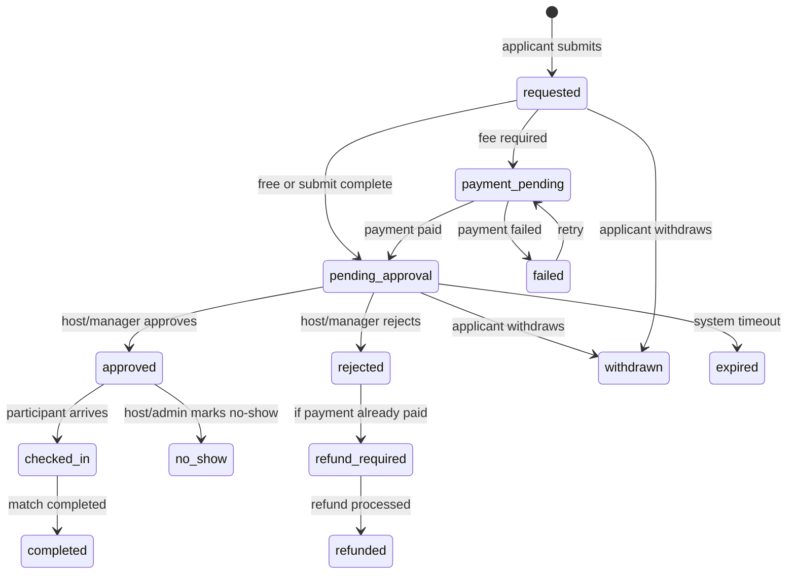
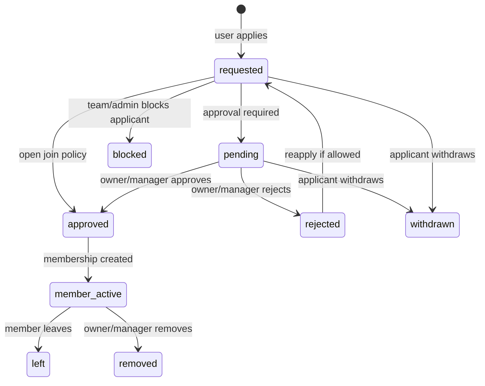
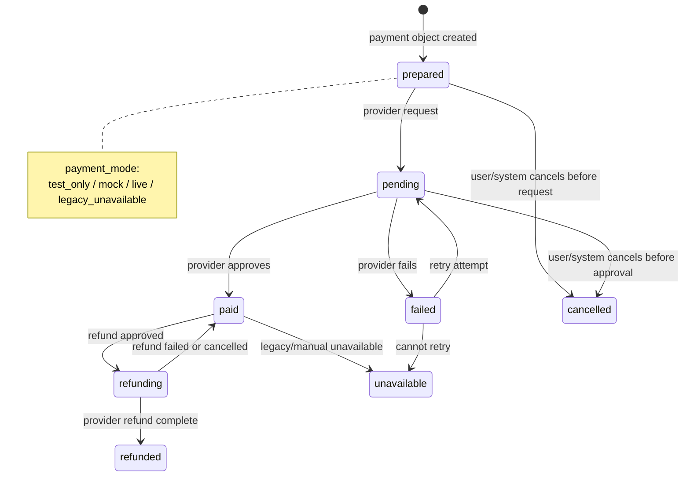
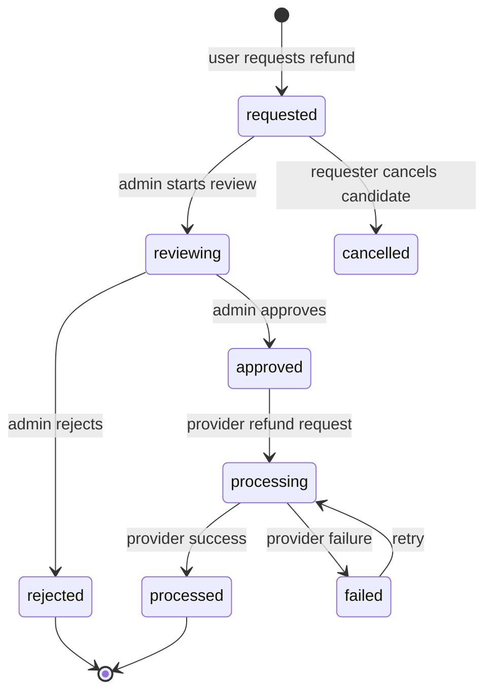
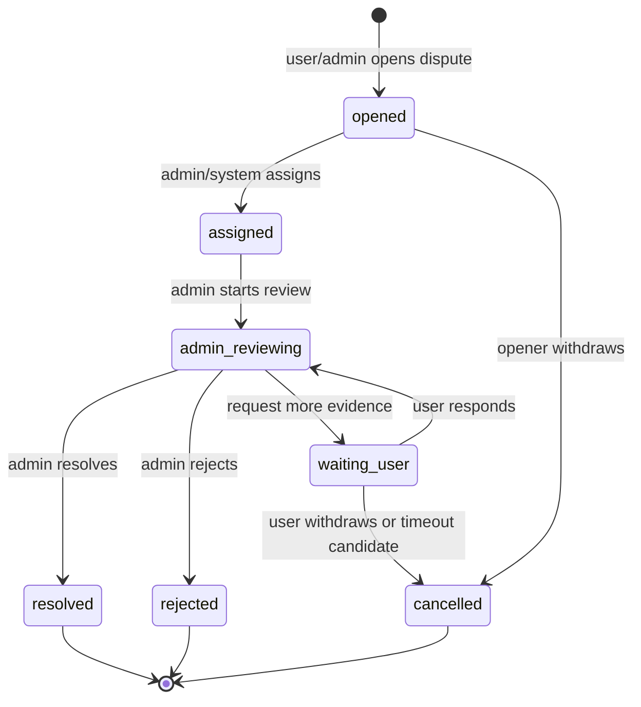
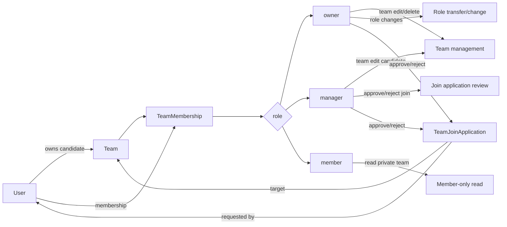
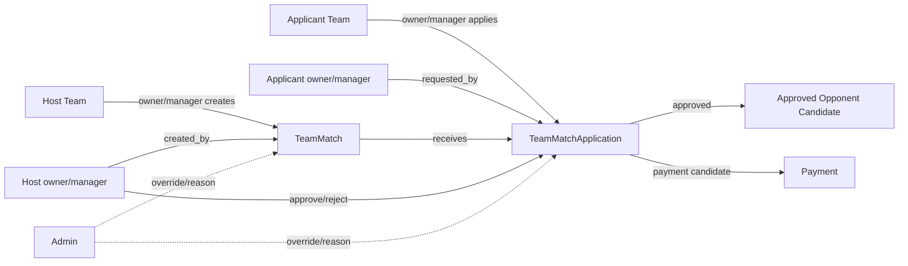
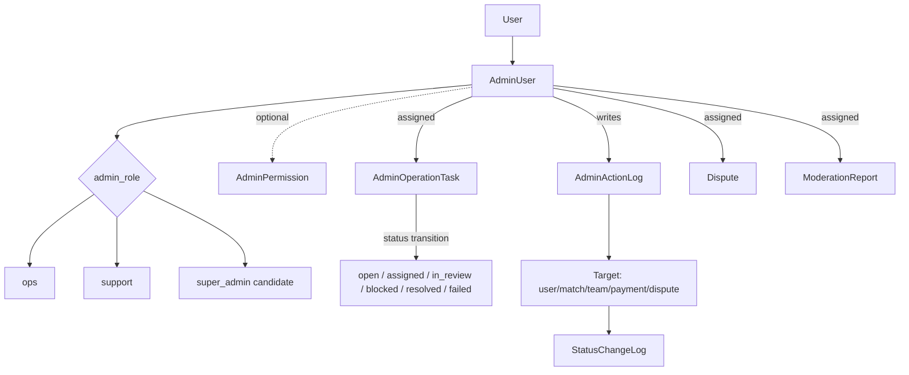

# SM New DB Lifecycle And Ownership Diagrams

```text
Status: draft lifecycle visualization
Source: docs/reference/team-design-first-design-db-plan.md
Design baseline: Team Design > 1차 디자인 완료
```

이 문서는 DB 초안에서 API 설계 전에 반드시 닫아야 하는 상태 전이와 권한/소유권
구조를 시각화한다. 아래 상태명은 후보이며 확정 enum이 아니다.

## 상태값 / Lifecycle

### 매치 신청



확인 필요:

- 결제 후 승인인지, 승인 후 결제인지.
- 자동 승인 match가 있는지.
- `failed`가 application status인지 payment status인지.
- no-show/attendance가 1차 범위인지.

### 팀 가입 신청



확인 필요:

- `requested`와 `pending`을 둘 다 둘 필요가 있는지.
- 자동 승인 팀과 수동 승인 팀의 공통 모델.
- 재신청 제한과 차단 정책.
- owner 단독 팀에서 탈퇴/삭제 처리.

### 결제



확인 필요:

- 재시도 시 같은 `payments` row 아래 `payment_attempts`를 추가할지.
- `test_only`와 `mock`의 사용자-facing copy.
- payment status와 application status의 동기화 규칙.
- idempotency key 저장 위치.

### 환불



확인 필요:

- 요청자가 환불 요청을 취소할 수 있는지.
- 자동 승인 조건.
- 부분 환불 여부.
- 환불 실패 후 결제/application 상태 복원 규칙.

### 분쟁



확인 필요:

- target 허용 범위: payment, match, team match, chat, report 등.
- dispute와 refund/payment 상태 연결 규칙.
- 재심/이의제기 여부.
- 담당자 배정 lock/concurrency.

## 권한 / Ownership 구조

### 사용자 ↔ 팀 ↔ 역할



위험:

- `teams.owner_user_id`와 `team_memberships.role=owner`가 이중 source가 될 수 있음.
- manager가 멤버 내보내기/팀 수정/owner 이전 중 어디까지 가능한지 확인 필요.

### 매치 생성자 ↔ 신청자 ↔ 승인자

```mermaid
flowchart LR
  Host[Host User] -->|creates| Match[Match]
  Applicant[Applicant User] -->|creates| App[MatchApplication]
  Match -->|receives| App
  Host -->|approve/reject| App
  Manager[Match Manager Candidate] -. "확인필요" .->|approve/reject| App
  Admin[Admin] -. override .-> App
  App -->|approved creates| Participant[MatchParticipant]
  Participant -->|optional payment link| Payment[Payment]
  Payment -->|attempts| Attempt[PaymentAttempt]
  Payment -->|refund candidate| Refund[RefundRequest]
```

위험:

- host가 자기 매치에 신청하지 못하도록 명시 차단 필요.
- 승인자와 결제 actor가 다를 수 있음.
- manager 모델이 1차 기능인지 확인 필요.

### 팀매치 생성 팀 ↔ 신청 팀



위험:

- 승인된 상대팀을 application row로만 표현할지 별도 pairing row로 둘지 확인 필요.
- 팀 단위 결제의 payer가 개인인지 팀인지 불명확.
- 여러 신청 동시 승인 race 처리 필요.

### 관리자 권한 구조



위험:

- admin role만으로 운영 권한을 닫을지, capability table을 둘지 확인 필요.
- `admin_action_logs`와 `status_change_logs`가 중복될 수 있음.
- partial failure, concurrent processing, lock owner가 아직 미정.

## API 설계 전 필수 확정 항목

| 우선순위 | 항목 | 이유 |
|---:|---|---|
| 1 | 신청/승인/결제 순서 | 개인 매치와 팀매치의 핵심 상태와 FK가 달라짐 |
| 2 | service team과 match-side team 명칭 | `Team` 용어 충돌로 API/DB drift 위험 |
| 3 | owner source | `teams.owner_user_id`와 membership owner 중 SSOT 결정 필요 |
| 4 | payment target 모델 | polymorphic target은 유연하지만 무결성 약함 |
| 5 | audit 책임 분리 | ledger/refund/status/admin log 중복 방지 |
| 6 | v1 제외 후보 | waitlist, user_drafts, chat_context_links, admin_permissions 등 scope control |
| 7 | trust/reputation source | summary만으로 verified/estimated/sample 근거 부족 |
| 8 | notification read 모델 | user별 notification이면 read table 과분리 가능 |

## 불명확성이 가장 큰 영역

| 영역 | 불명확성 |
|---|---|
| 결제/환불/분쟁 | test/mock/live/legacy unavailable, 재시도, 환불, 신청 상태 연결 |
| 팀매치 | 신청 팀 권한, 승인된 상대팀 모델, 결제 주체, 무료초청/심판/용병 범위 |
| 개인 매치 신청 | 결제 전 승인인지 승인 전 결제인지, 대기열/노쇼/출석 포함 여부 |
| 관리자/audit | role vs capability, task lock, partial failure, 공통 status log 책임 |
| 홈 추천/통계/신뢰 | 저장/캐시/계산 경계와 산정 source event |
